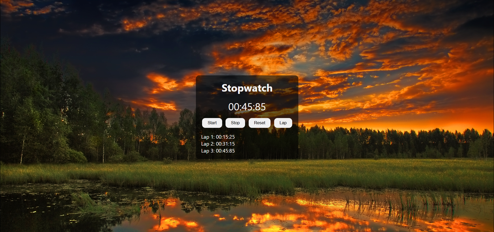

# ⏱️ Stopwatch Web Application

🚀 A modern and stylish **Stopwatch application** built with **HTML**, **CSS**, and **JavaScript**.

This project features:
- ⏳ Start / Stop / Reset functionality
- 🏁 Lap time recording support
- ⏲️ Millisecond-precision tracking
- 🎨 A visually rich background interface with clean layout
- ⚡ Seamless transitions and intuitive UX

🔧 Designed to practice and showcase DOM manipulation, timing events, and clean UI styling in vanilla JavaScript.

✨ Feel free to fork, use, and modify it!

